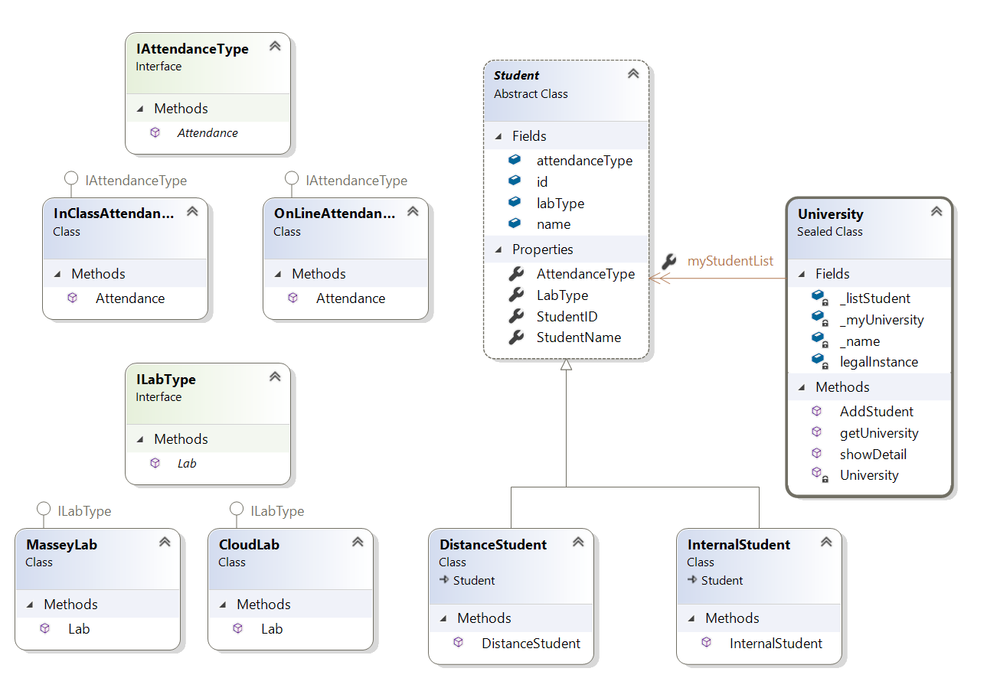
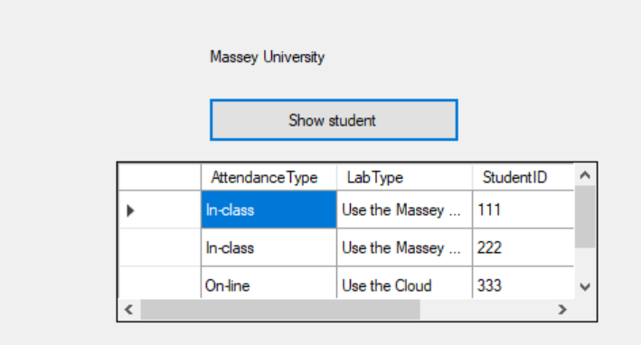

# Simple-university-student-enrolment-system

A simple university student enrolment system that can record and display the informations of internal students and distance students.

I am utilizing the strategy pattern to design and write my code:

At present, the program requires the user to manually enter student information by editing the code. However, this can be modified and updated as needed in the future.

The program displays all student information, but the window may need to be adjusted for optimal viewing in the future.

